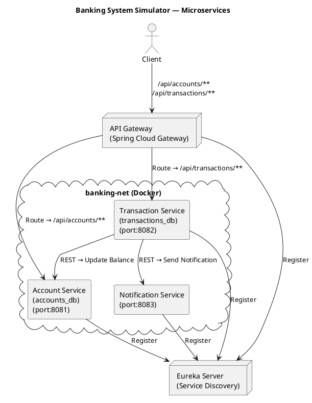

# Banking System Simulator — Microservices Architecture  
**Spring Boot + Spring Cloud + MongoDB + Docker**

---

## 📌 Project Overview
This project implements a **modular banking system** using a Microservices Architecture.  
Each domain (Accounts, Transactions, Notifications) runs as an independent Spring Boot microservice with its own MongoDB database.

All services communicate via **REST APIs**, register with **Eureka Server**, and route through **Spring Cloud Gateway**.  
The entire system is containerized using **Docker & Docker Compose**.

---

## ✔ Microservices Included
- **Eureka Server** – Service Discovery  
- **API Gateway** – Entry point + routing  
- **Account Service** – Account CRUD + balance updates  
- **Transaction Service** – Deposit/Withdraw/Transfer + Circuit Breaker  
- **Notification Service** – Simulated notification logs  

---

## ✔ Tech Stack
- Java 17  
- Spring Boot 3.x  
- Spring Cloud (Eureka, Gateway, LoadBalancer)  
- MongoDB  
- RestTemplate + @LoadBalanced  
- Resilience4j Circuit Breaker  
- SLF4J + MDC Correlation ID logging  
- Docker & Docker Compose  
- JUnit 5 + Mockito  

---


### PlantUML Source (for export):


---

# 📁 Folder Structure (Deliverables)
```
banking-system-microservice/
│
├── eureka-server/
│   ├── src/
│   ├── Dockerfile
│   └── pom.xml
│
├── api-gateway/
│   ├── src/
│   ├── Dockerfile
│   └── pom.xml
│
├── account-service/
│   ├── src/
│   ├── Dockerfile
│   └── pom.xml
│
├── transaction-service/
│   ├── src/
│   ├── Dockerfile
│   └── pom.xml
│
├── notification-service/
│   ├── src/
│   ├── Dockerfile
│   └── pom.xml
│
├── docker-compose.yml
└── README.md
```

---

# ⚙️ How to Run the Entire System (Docker Compose)

### 1️⃣ Ensure Docker Desktop is running  
### 2️⃣ From project root:
```bash
docker-compose up -d
```

### 3️⃣ Verify services:
- Eureka → http://localhost:8761  
- API Gateway → http://localhost:8085  

### 4️⃣ Stop everything:
```bash
docker-compose down
```

---

# 🧪 API Endpoints

## **Account Service**
| Method | Endpoint | Description |
|--------|----------|-------------|
| POST | `/api/accounts` | Create account |
| GET | `/api/accounts/{accNo}` | Fetch account |
| PUT | `/api/accounts/{accNo}/balance` | Update balance |
| PUT | `/api/accounts/{accNo}/status` | Update status |

---

## **Transaction Service**
| Method | Endpoint | Description |
|--------|----------|-------------|
| POST | `/api/transactions/deposit` | Deposit amount |
| POST | `/api/transactions/withdraw` | Withdraw amount |
| POST | `/api/transactions/transfer` | Transfer amount |
| GET | `/api/transactions/account/{accNo}` | Transaction history |

---

## **Notification Service**
| Method | Endpoint | Description |
|--------|----------|-------------|
| POST | `/api/notifications/send` | Send notification |

---

# 🔁 Example Test Flow (via Gateway)

### 1️⃣ Create Account
```
POST http://localhost:8085/api/accounts
```
Body:
```json
{
  "accountNumber": "ACC1001",
  "holderName": "Sachin",
  "balance": 5000
}
```

### 2️⃣ Deposit
```
POST http://localhost:8085/api/transactions/deposit?accountNumber=ACC1001&amount=500
```

### 3️⃣ Withdraw
```
POST http://localhost:8085/api/transactions/withdraw?accountNumber=ACC1001&amount=200
```

### 4️⃣ Transfer
```
POST http://localhost:8085/api/transactions/transfer?sourceAccount=ACC1001&destinationAccount=ACC2001&amount=300
```

### 5️⃣ Transaction History
```
GET http://localhost:8085/api/transactions/account/ACC1001
```

---

# 🛡 Resilience & Logging
### ✔ Circuit Breaker  
Resilience4j handles failures for Account Service calls.

### ✔ Logging  
- SLF4J structured logs  
- Correlation ID using MDC  
- Distributed tracing across microservices  

---

# 🧪 Unit Tests
Run:
```bash
mvn test
```

Covers:
- Service layer  
- Mockito mocks  
- Behavior validation  

---

# 👨‍💻 Contributor
**Sachin Birajdar** — Developer  

---

# 📝 Notes  
This system demonstrates a fully containerized microservices architecture with Spring Cloud, MongoDB, Docker, and distributed logging.
